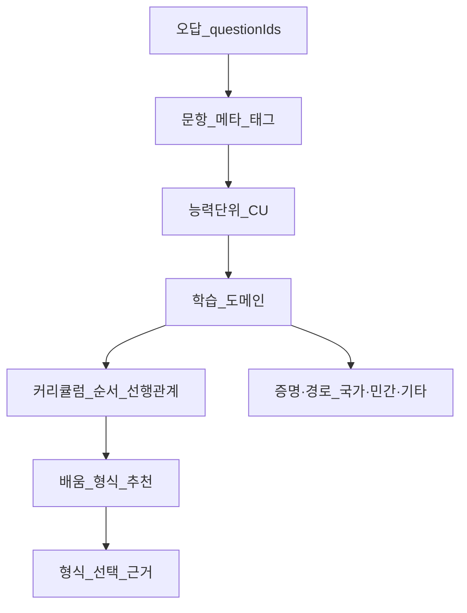

# KAPP 학습·교육 플랫폼 전환 — 프론트·제품 제안서

> **문서 목적:** 진단 중심 서비스에서 **학습·문제풀이 기반**으로 확장하면서, 프론트엔드와 제품 측면에서 무엇을 추가·변경하면 좋은지 **마케팅 / 기획·UX / 개발** 관점으로 정리한다.  
> **코드 근거:** 현재 구현은 `app/app/diagnosis/page.tsx`, 문항 데이터는 `data/kappDiagnosis/*.json`, 교육 메뉴는 `app/app/education/page.tsx`를 기준으로 한다.

---

## 1. 배경 요약

- **기존:** 직무 역량 **진단·평가** 중심 (CAT 기반 지식 문항 등).
- **변경 방향:** **학습·교육 + 역량 진단** 병행, **문제 풀이 → 해설 → 오답 복습 → 반복 학습** 구조.
- **프론트에서의 함의:** “점수만 내는 화면”에서 **해설 노출, 오답 추적, 복습 UX, 학습 데이터 적재**로 확장할 필요가 있다.

---

## 2. 마케팅 관점

### 2.1 포지셔닝

- **평가 도구**보다 **짧고 가벼운 실무 학습·복습 도구**로 메시지를 통일한다. (인강 대비 부담 완화, 회의록의 B2B 포지셔닝과 정합)
- “역량 점수” 단독 강조보다 **“이번 세션에서 익힌 내용 / 다음에 볼 주제”**를 함께 노출해 **성장 서사**를 만든다.

### 2.2 랜딩·온보딩·B2B 커뮤니케이션

- HR/인사 담당자 **거부감 완화:** “내부 평가를 대체한다”가 아니라 **직원 교육·HRD 보완** 도구로 명시.
- 도입 스토리 예: 진단 결과만이 아니라 **해설·복습 리포트**로 교육 담당자가 프로그램을 설계할 수 있다는 점.

### 2.3 학습자에게의 가치 제시

- **해설·오답 리포트·진행률**을 “평가 결과”가 아닌 **학습 성과·복습 우선순위**로 프레이밍.
- 대시보드/결과 화면에서 **취약 영역 → 추천 학습(추후 `education` 연동)** CTA를 자연스럽게 배치.

---

## 3. 기획·UX 관점

### 3.1 K · A · P 단계: 피드백 패턴 통일

- **지식·적용·성과** 문항은 데이터 상 `explanation`(및 정답 인덱스)가 이미 존재할 수 있으나, 현재 UI는 **선택 저장 후 바로 다음 문항**으로 넘어가 **정오답·해설이 보이지 않는 흐름**이다.
- **제안:** 답을 고른 뒤 **최소 한 번**은 다음을 보여 주는 패턴으로 통일한다.
  - 정답 여부(또는 모범 답안 강조)
  - 해설(근거)
  - (선택) “이 개념 다시 보기” 링크 또는 태그

### 3.2 오답 노트 · 복습 큐

- 풀이 중 **오답 문항 ID·영역·타임스탬프**를 누적한다.
- **오답만 모아보기**, **나중에 다시 풀기** 큐를 제공해 회의록의 “링글식 반복 구조”와 정렬한다.
- MVP에서는 “세션 내 복습”부터, 이후 “이전 세션 오답 불러오기”로 확장.

### 3.3 학습 기록

- **세션별·영역(K/A/P)별** 정답률, 시도 횟수, 해설 조회 여부.
- 문항 메타(난이도·직무 태그)와 연동하면 **취약 태그** 요약이 가능하다.

### 3.4 디지털 인바스켓

- 시뮬레이션 완료 후 **요약·모범 행동·해설** 노출을 검토한다. (순수 객관식과 다른 형태이므로 “학습 포인트” 문구로 정리)

### 3.5 Step 6 결과 · 교육 허브 연결

- `app/app/education/page.tsx`는 현재 플레이스홀더이므로, 결과 화면에서 **“추천 학습 보기”** 등으로 연결하는 **정보 구조**를 먼저 설계한다.

---

## 3.6 UI/UX 보강: “풀면서 배우는” Top-Down 경험

프로젝트 과제가 없더라도, 사용자가 **맥락(Why) → 실전(What/How) → 점검(Check)** 순으로 내려오는 **Top-Down** 느낌을 주면 “진단만 받고 끝”이 아니라 **학습 세션**으로 인지하게 할 수 있다.

### 3.6.1 정보 구조 (한 세션 안에서의 계층)

| 층위 | UI에 담을 내용 | 느낌 |
|------|----------------|------|
| **L1 맥락** | 이번 단계(지식/적용/성과)가 직무에서 왜 중요한지 1~2문장, 또는 “이번에는 ○○ 역량을 다룹니다” | 목표가 먼저 보임 |
| **L2 과제** | 시나리오·문항 본문 | 실무 상황에 몰입 |
| **L3 피드백** | 정오답 + 해설 + (가능하면) **오개념/함정** 한 줄 | 풀면서 배움 |
| **L4 연결** | “다음에 복습할 키워드” 또는 태그 | 세션이 끊기지 않음 |

- 외부에서 자주 쓰는 **피드백 루프** 표현(성과 신호 분석 → 갭 식별 → 맞춤 개입 → 유지·검증)과도 맞물린다. 짧은 문항 세션을 **연속된 루프**로 보여 주면 “학습 플랫폼” 인상이 강해진다.

### 3.6.2 화면 단위 UX 아이디어

- **진행 표시:** 단순 % 막대보다 **K → A → P** 또는 **주제 단위**로 나뉜 세그먼트(완료 시 체크)로 “한 과목을 여러 챕터로 듣는” 느낌.
- **해설 노출 방식:** 바로 정답을 크게 박기보다, 선택 직후 **“왜 이 선택이 중요한가”** 한 줄 → 필요 시 **상세 해설 펼치기**로 단계화(난이도 높은 문항에서 인지 부담 완화).
- **오답 강조:** 틀린 선지는 붉은 X만이 아니라 **“많은 사람이 헷갈리는 포인트”**를 짧게 넣어 학습 콘텐츠처럼 느껴지게 함.
- **마이크로 리플렉션(선택):** 해설 다음에 “이 개념을 내 업무에 적용한다면?” 한 문장 선택형(시간 10초 이내) — 데이터는 **학습 의도·이전 지식** 추정에 쓸 수 있음(동의 하에).
- **모바일·짧은 세션:** 한 화면에 질문+선지+다음 CTA가 한눈에 들어오게, 스크롤은 해설·추가 읽기에만 사용.

### 3.6.3 학습과학 쪽에서 유의할 점 (요약)

- **설명형 피드백**(왜 맞는지/틀렸는지)은 단순 정답 제시보다 **이해·이전**에 유리하다는 연구가 많다. 다만 과제가 매우 어렵다고 느껴질 때 **즉시 긴 설명**이 오히려 부담이 될 수 있어, **짧은 요약 → 상세** 2단이 안전하다.
- **오류 예시·오개념**을 다룰 때는 설명 방식과 난이도에 따라 인지 부하가 커질 수 있으므로, 문항당 **핵심 한 가지**만 밀도 있게 다루는 편이 낫다.

---

## 3.7 리포트 UI/UX: 진단 + 교육 + 학습을 한 화면에서 잇기

회의 방향(진단에서 벗어나 학습·복습으로)에 맞춰, **결과 리포트**는 “점수 카드” 한 장이 아니라 **개인 맞춤 행동 계획**에 가깝게 설계하는 것을 제안한다.

### 3.7.1 리포트 상단: 맞춤형 진단 요약

- **역량 프로필**(레이더·막대) + **한 줄 해석**(“○○ 영역은 상대적으로 보완 여지가 있습니다”) — 숫자만 나열하지 않기.
- **틀린 문항·취약 태그:** 영역(K/A/P)·세부 주제(문항 메타)·난이도별로 **어떤 유형을 틀렸는지** 목록 또는 히트맵.
- **다음 행동 3가지:** 예) “○○ 개념 복습”, “적용 시나리오 2문항 재도전”, “추천 자료 1개” — 클릭 시 `education` 또는 내부 콘텐츠로 연결.

### 3.7.2 보완 필요 영역 → 도메인·자격·학습 경로 추천

- **도메인 추천:** 취약 태그(예: 재무 분석, 데이터 규제, 커뮤니케이션)와 매핑된 **학습 주제 묶음**을 노출. (내부 커리큘럼명 또는 외부 과정명은 **검수된 목록**만 노출하는 것이 신뢰에 유리.)
- **자격·공인 시험:** 직무과 매핑이 명확한 경우에만(예: 특정 산업 규제, IT 인증). 세계경제포럼 등에서 강조하는 **스킬 퍼스트**·**이동 가능한 역량 증명** 흐름과도 맞출 수 있으나, **지역·시험 제도가 다르므로** “참고용”·“담당자와 상담” 문구를 기본으로 한다.
- **개인화의 한계 명시:** 추천은 **응시 데이터 + 직무 메타** 기반 추정이므로, “최종 학습 계획은 조직 HRD 정책과 병행” 같은 **투명한 고지**가 좋다.

### 3.7.3 리포트 내 시각적 패턴

- **Before → After(목표):** 이번 세션 vs 이전 세션(또는 조직 평균과 비교) — **성장 서사**.
- **오답 전용 섹션:** “복습 큐에 담기” 버튼으로 **바로 재학습 루프**로 연결.

> **심화:** 오답 → 능력단위 → 도메인 → 커리큘럼 순서·배움 형식·자격 외 경로까지 이어지는 **데이터 요건·더미 시나리오**는 아래 **§3.8~3.10**에서 다룬다.

---

## 3.8 오답 기반 리포트·학습경로 설계 (상세 기획)

학습자가 KAPP 진단에서 **틀린 문항**이 있을 때, 리포트는 “점수”를 넘어 **무엇이 부족한지 → 어떤 능력단위에 귀속되는지 → 무엇을 어떤 순서로 배우면 좋은지**까지 한 흐름으로 보여 주는 것을 목표로 한다.

### 3.8.1 흐름 (데이터 파이프라인 관점)

### 3.8.2 리포트에 노출하면 좋은 블록 (프론트)

| 순서 | 블록 이름 | 사용자에게 주는 가치 |
|------|-----------|------------------------|
| 1 | **갭 유형 요약** | 틀린 문항이 **지식형 / 적용형 / 판단형 / 절차형** 등 어떤 패턴인지 한눈에 (예: “개념 혼동 2건, 조건 분기 실수 1건”) |
| 2 | **귀속 능력단위(CU)** | 각 오답 문항에 매핑된 **능력단위 ID·이름** (내부 프레임; 예: “재무 지표 해석”, “규제 준수 판단”) |
| 3 | **공통·연관 도메인** | 여러 오답에서 공통으로 올라오는 **학습 도메인**(예: “기업 신용 분석 기초”, “개인정보 처리 실무”) |
| 4 | **보충 추천 도메인** | 위를 바탕으로 **우선 보완할 도메인 2~4개** (우선순위 점수 또는 색상) |
| 5 | **추천 커리큘럼(순서)** | 도메인 간 **선행·연계**를 반영한 **학습 순서** (1→2→3). 선행이 없으면 병렬 표기 |
| 6 | **배움의 형식** | **프로젝트형 / 인강·마이크로러닝 / 워크숍·코칭 / 독서·가이드 / 사내 샌드박스 실습** 등 1~2개 추천 |
| 7 | **왜 이 형식인가** | 짧은 근거(예: “적용 오류가 많아 **케이스 기반 실습**이 효과적”, “용어 혼동이 많아 **짧은 개념 모듈** 먼저”) |
| 8 | **증명·다음 스텝 (자격 외 포함)** | 아래 **3.8.4** 참고 |

### 3.8.3 배움 형식을 고를 때의 기준 (기획 규칙 예시)

| 갭 신호 | 추천 형식 | 효과를 기대하는 이유 (리포트에 한 줄) |
|---------|-----------|----------------------------------------|
| 용어·정의 혼동 | 마이크로 모듈·인강·플래시카드형 | 인지 부하를 낮춰 **정확한 개념 정립**이 선행 |
| 조건·절차 오류 | 체크리스트 실습·시뮬 | **순서·분기**를 몸에 익히게 함 |
| 맥락 적용 실패 | 프로젝트·케이스 스터디 | **이전 지식을 새 상황에 이전(transfer)** |
| 규정·윤리 판단 | 가이드라인 독서 + 토론·워크숍 | **회색지대 판단**은 규범과 사례가 함께 필요 |
| 도구·워크플로우 | 샌드박스·핸즈온 | **도구 리터러시**는 직접 조작이 효율적 |

### 3.8.4 자격증 외에 리포트에 넣을 수 있는 “증명·경로” (확장)

국가자격·민간자격만이 아니라, 아래를 **조직 정책과 병행**해 제시할 수 있다.

| 유형 | 예시 | 비고 |
|------|------|------|
| **디지털 배지·마이크로크레덴셜** | 과정 단위 완료 배지, 스킬 스택 | 짧은 단위 학습과 궁합 |
| **내부 인증·레벨** | 사내 테스트 통과, 멘토 서명 | 금융·보안 환경에서 외부 자격 대체 |
| **포트폴리오·산출물** | 리포트 샘플, 자동화 스크립트 | 프로젝트형과 연계 |
| **커뮤니티·스터디·모임** | 사내 CoP, 직무 커뮤니티 | 지속 학습 동기 |
| **멘토링·Job shadowing** | 시니어 1:1, 부서 관찰 | 적용형 갭에 적합 |
| **공식 교육 이수 증명** | 협회·대학·플랫폼 이수증 | 자격이 아닌 **이수**로도 경로 제시 |
| **공개 기여·검증** | 기술 블로그, 오픈소스 기여 | IT·마케팅 등 선택적 |

---

## 3.9 필요 데이터 (리포트 엔진이 쓰는 입력)

**원칙:** 오답만으로는 “능력단위”까지 자동 도출되지 않는다. **문항 메타·매핑 테이블**이 있어야 한다.

| 데이터 | 설명 | 예시 필드 |
|--------|------|-----------|
| **문항 마스터** | 문항 ID, K/A/P, 산업·직무, 난이도, 정답 인덱스 | `questionId`, `kap`, `industry`, `job`, `difficulty`, `answerIndex` |
| **오답 로그** | 세션·사용자(또는 익명 세션), 선택한 오답 인덱스 | `sessionId`, `questionId`, `chosenIndex`, `ts` |
| **오답 유형 태그** | 기획 정의 분류 (선택) | `gapType`: concept / procedure / application / compliance … |
| **능력단위(CU) 마스터** | 조직 또는 KAPP 공통 프레임 | `cuId`, `name`, `description`, `kap` |
| **문항–능력단위 매핑** | N:M 가능 | `questionId`, `cuId`, `weight` |
| **학습 도메인 마스터** | 교육 콘텐츠 묶음 단위 | `domainId`, `name`, `summary` |
| **능력단위–도메인 매핑** | CU가 어떤 학습 주제로 보완되는지 | `cuId`, `domainId`, `relevance` |
| **도메인 선행 그래프** | 커리큘럼 순서 | `domainId`, `requiresDomainIds[]` |
| **형식 추천 규칙** | 갭 유형·CU·도메인 → 형식 | 규칙 테이블 또는 가중 스코어 |
| **증명 경로 카탈로그** (선택) | 자격·배지·사내 인증 | `credentialType`, `name`, `issuer`, `domainIds[]` |
| **직무·직급 컨텍스트** | 추천 톤 조정 | `jobFamily`, `years`, `goal` (진단 입력과 동일) |

**MVP:** `문항–CU`, `CU–도메인`, `도메인 선행` 3종만 있어도 **“틀린 문항 → 추천 순서”**의 최소 버전은 동작한다.

---

## 3.10 부록: 페르소나 더미 시나리오 (리포트 출력 예시)

### 페르소나

- **이름:** 김민지 (가명)
- **직무:** 카드사 마케팅 (진단 입력: 금융·마케팅/광고 계열, 연차 4년)
- **틀린 문항 (가정):**
  1. **지식(K):** “NIM·수익 구조” 관련 문항 — **가맹점 수수료(MDR)** 가 아닌 항목을 선택 (개념 혼동)
  2. **적용(A):** “개인정보가 포함된 캠페인 데이터를 외부 툴에 넣기 전 검토” 시나리오 — **최소 비식별·내부 승인**이 아닌 빠른 분석 옵션 선택 (규제·절차)
  3. **성과(P):** “ROAS 하락 시 우선 조정할 레버” — 채널 예산보다 **소재·랜딩 일관성**이 우선인 상황에서 오선택 (지표 해석·우선순위)

### 리포트에 이렇게 나오면 좋다 (더미 텍스트)

#### 1) 갭 유형 요약

- **개념 1건:** 카드 수익 구조 핵심 지표와 수익원의 대응 관계
- **규제·절차 1건:** 캠페인 데이터의 **개인정보·외부 반출**을 전제로 한 의사결정
- **지표·우선순위 1건:** 퍼포먼스 지표 악화 시 **원인 분기(소재 vs 채널 vs 랜딩)**

#### 2) 귀속 능력단위 (예시 ID)

| 오답 문항 | 귀속 능력단위 (예시명) |
|-----------|-------------------------|
| K-금융-수익구조 | `CU-FIN-01` 금융 상품·수익 메커니즘 이해 |
| A-마케팅-PII | `CU-LEG-04` 마케팅 데이터 활용 시 개인정보·동의 범위 판단 |
| P-마케팅-ROAS | `CU-MKT-07` 캠페인 지표 진단 및 개입 우선순위 설정 |

#### 3) 공통·연관 학습 도메인 (집계)

- **도메인 A:** 카드·금융 비즈니스 기초 (수익원·KPI)
- **도메인 B:** 마케팅 데이터 거버넌스 (PII, 제3자 도구)
- **도메인 C:** 퍼포먼스 마케팅 분석 (ROAS, 실험·원인 분기)

#### 4) 보충 추천 순서 (커리큘럼)

1. **도메인 A** 먼저 — 이후 지표·ROAS 맥락이 안정적으로 붙음  
2. **도메인 C** — “무엇을 먼저 손댈지” 판단 연습  
3. **도메인 B** — 실무 데이터를 다룰 때 **절차·보안**을 몸에 익힘  

*(실제로는 도메인 B가 A·C보다 선행이어야 하는 조직도 있음 → **선행 그래프**로 조정)*

#### 5) 배움의 형식 추천

- **도메인 A:** 짧은 **마이크로 모듈 + 퀴즈** (개념 정합)
- **도메인 C:** **케이스 스터디·시뮬** (지표 해석·우선순위)
- **도메인 B:** **가이드라인 독서 + 체크리스트 실습** (내부 규정이 있으면 사내 문서 연계)

#### 6) 왜 이 형식인가 (리포트 한 줄 근거)

- 개념 오류는 **짧은 모듈로 정의를 고정**한 뒤 적용으로 넘어가는 것이 효율적이다.
- ROAS 문제는 **표만 보는 것보다 시나리오 분기**가 이전에 유리하다.
- PII 이슈는 **절차·승인**이 핵심이라 체크리스트·실무 흐름이 맞다.

#### 7) 자격·그 외 경로 (참고)

- **민간:** 디지털 마케팅·데이터 관련 협회 과정·클라우드 벤더 학습 경로 (직무 매핑 시)
- **국가:** 해당 직무에 직접 의무가 아닐 수 있음 → “참고”로 표기
- **그 외:** 사내 **데이터 거버넌스 이수 배지**, **캠페인 실습 산출물** 포트폴리오, **사내 CoP** 참여

---

## 3.11 외부 참고 (요약·출처)

- **직장 내 AI·역량:** OECD는 AI 원칙 가운데 노동시장 전환과 인적 역량 강화를 다루며, 직장 내 AI 확산과 기술 수요 변화에 대한 정책 논의를 제공한다 ([OECD AI Principles](https://www.oecd.org/en/topics/ai-principles.html), [Principle 2.4 대시보드](https://oecd.ai/en/dashboards/ai-principles/P13)).
- **역량·스킬 우선:** 세계경제포럼 등에서 **스킬 퍼스트**·디지털 전환에 맞춘 역량 재편을 강조하는 보고가 다수 있다 (예: [WEF Skills 관련 보고](https://reports.weforum.org/) — 제목·연도별로 인용).
- **피드백 루프·마이크로 학습:** 짧은 평가를 반복하고 개입으로 이어지는 **루프 학습** 구조를 설명하는 가이드([Doozy — Looped learning](https://doozy.live/guides/feedback-loops) 등)를 UX 스토리보드 참고로 쓸 수 있다.
- **자격·수요 불일치:** 조지타운 CEW 등 **자격과 노동 수요의 정합** 연구는 “추천 자격증” 기능을 넣을 때 **과장 없이 조건부 추천**해야 함을 시사한다.

---

## 4. 개발 관점

### 4.1 즉시 활용 가능한 개선 (데이터는 이미 있는 경우)

- `knowledgeQuestions.json` 등에 `explanation`이 있으면, `page.tsx`의 step 2~4에서 **선택 직후 또는 “해설 보기” 후 다음**으로 분기하는 UI를 추가한다.
- 적용·성과 JSON에 해설 필드가 없다면 **기획·콘텐츠 측에서 필드 추가** 후 동일 패턴으로 노출한다.

### 4.2 상태 모델 확장 (초안)

- 기존 `answers`(선택 인덱스 배열) 외에 예시:
  - `wrongQuestionIds: { domain: string; questionId: string }[]`
  - `reviewQueue: string[]` (복습 대기 ID)
  - `seenExplanationAt: Record<questionId, timestamp>` (해설 열람 로그)
- **1차:** `localStorage` + 진단 세션 키. **2차:** 사용자 계정·LMS API와 동기화.

### 4.3 인바스켓

- 완료 상태 `answers.etray`와 연동해, 완료 문항별 **피드백 블록**을 렌더할지 여부를 데이터 스키마와 맞춘다.

### 4.4 비기능·거버넌스

- 오답·관심·행동 로그 수집 시 **개인정보·동의 범위**와 **익명/집계** 정책을 명시.
- B2B에서 **부서 단위 집계**가 필요하면 식별자 설계를 사전에 맞춘다 (회의록의 관리자 LMS 연동과 연계).

---

## 5. 우선순위 제안 (로드맵)

| 단계 | 내용 |
|------|------|
| **MVP-1** | K/A/P에서 선택 후 **정오답 + 해설** 노출 (패턴 통일) |
| **MVP-2** | 오답 ID 저장, **오답 노트** 화면 또는 결과 탭에서 요약 |
| **MVP-3** | 복습 큐(동일 문항 재출제 또는 유사 난이도) |
| **이후** | **리포트(3.7~3.10):** 갭·능력단위·도메인·커리큘럼·형식·근거·증명경로, `education` 연동, 관리자 대시보드 |

---

## 6. 코드베이스 참조 (사실관계)

| 항목 | 경로 / 비고 |
|------|-------------|
| 지식 문항 데이터 | `data/kappDiagnosis/knowledgeQuestions.json` — `explanation` 필드 존재 |
| 진단 UI | `app/app/diagnosis/page.tsx` — step 2~4는 해설 미표시, step 5 AI는 선택 후 `explanation` 소형 표시 |
| 교육 페이지 | `app/app/education/page.tsx` — 추후 구현 예정 |
| 시스템 흐름 | `docs/kapp-workflow-system-flows.md`, `public/docs/KAPP_DIAGNOSIS_QUESTION_LOGIC.md` |

---

*본 문서는 방향 전환에 따른 제안이며, 실제 스프린트 범위는 팀 합의 후 조정한다.*
